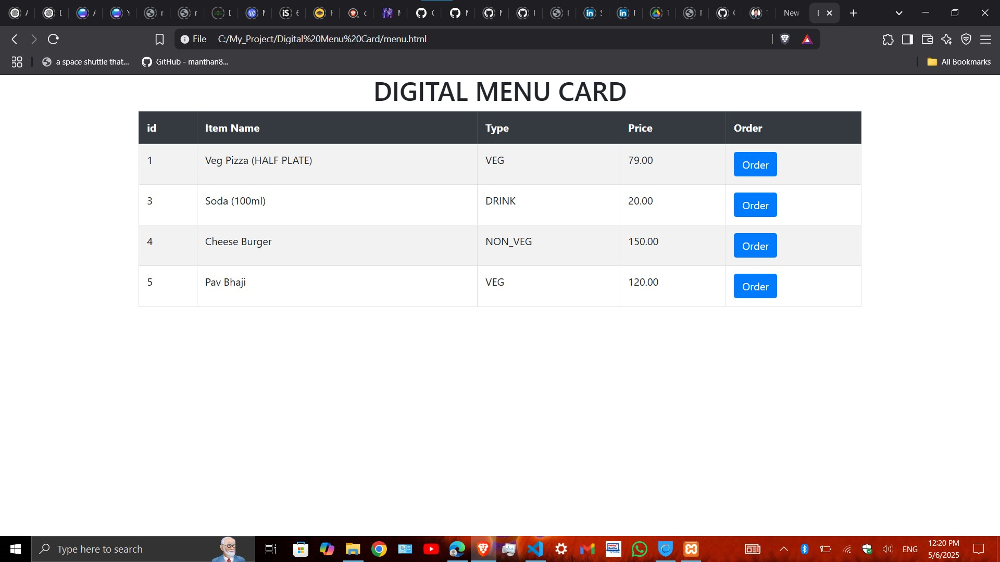
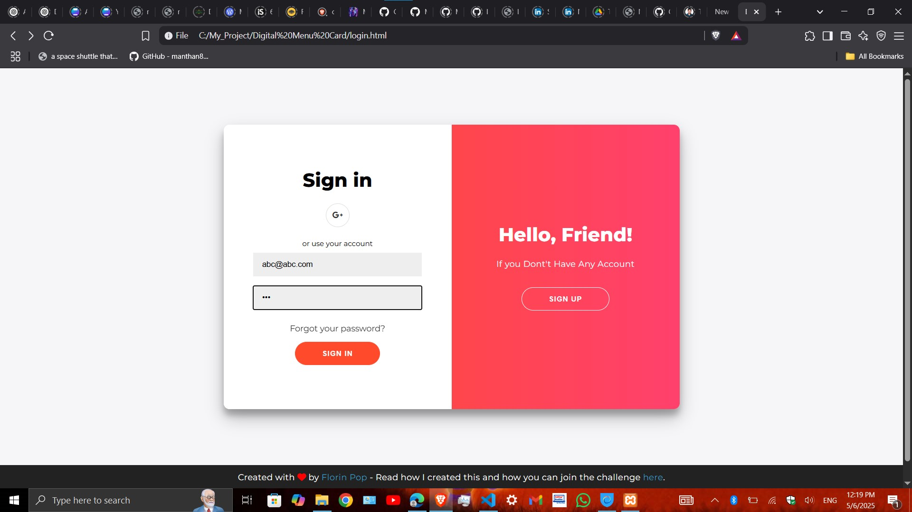

# 🍽️ Digital Menu Card

A responsive and interactive digital menu system that allows customers to browse food items and place orders online. It includes a full-featured admin panel where the restaurant owner can manage products and categories efficiently.




---

## 📌 Project Duration
**Aug 2023 – Feb 2024**

---

## 🏢 Associated With
Loknete Gopinathji Munde Institute of Engineering & Research Center

---

## 🔥 Key Features

### 🌟 User Panel
- Customers can view all food products organized by category.
- Ability to place food orders from the menu.
- Clean and responsive UI for all screen sizes.

### 🌟 Admin Panel
- Add, edit, delete food products.
- Add and manage item categories.
- View and manage orders placed by customers.
- Secure admin login/logout system.

---

## ⚙️ Technologies Used

- **Frontend**: HTML, CSS, JavaScript
- **Backend**: PHP
- **Database**: MySQL (via XAMPP)
- **API**: Custom-built PHP APIs for operations
- **Tools**: XAMPP, phpMyAdmin

---

## 🛠️ How to Run the Project

1. **Clone the Repository**
   ```bash
   git clone https://github.com/MrCoder420/Digital-Menu-Card.git
Set Up the Database

Open phpMyAdmin

Create a database (e.g., menu_card)

Import the menu_card.sql file located in the project folder

Update DB Credentials in config.php


$host = 'localhost';
$user = 'root';
$password = '';
$db = 'menu_card';
Run Project Locally

Start Apache and MySQL in XAMPP

Open browser and go to:
http://localhost/Digital-Menu-Card/


🗂️ Folder Structure

Digital-Menu-Card/
├── admin/         # Admin panel pages
├── api/           # PHP APIs for menu & order operations
├── assets/        # CSS, JS, Images
├── config.php     # Database connection
├── index.php      # Main menu UI
└── menu_card.sql  # MySQL database dump


🚀 Future Enhancements
Online payment integration (e.g., Razorpay/UPI)

Customer login/registration

Live order tracking

SMS or email notifications

📎 Useful Links
🔗 GitHub Repository: MrCoder420/Digital-Menu-Card

🙋 Author
Nikhil Sunil Bhor
Frontend & Backend Developer
GitHub: MrCoder420

